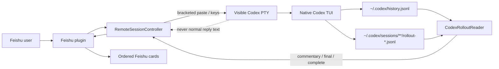
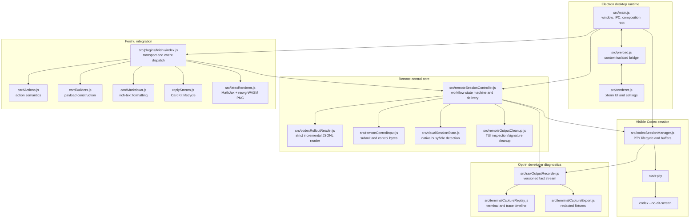
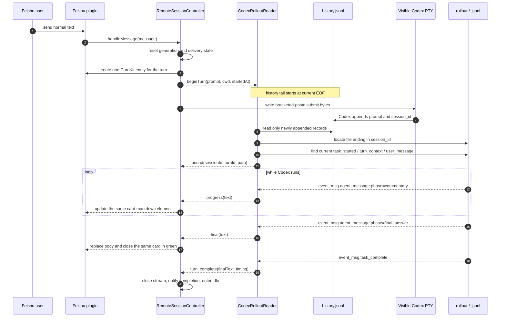
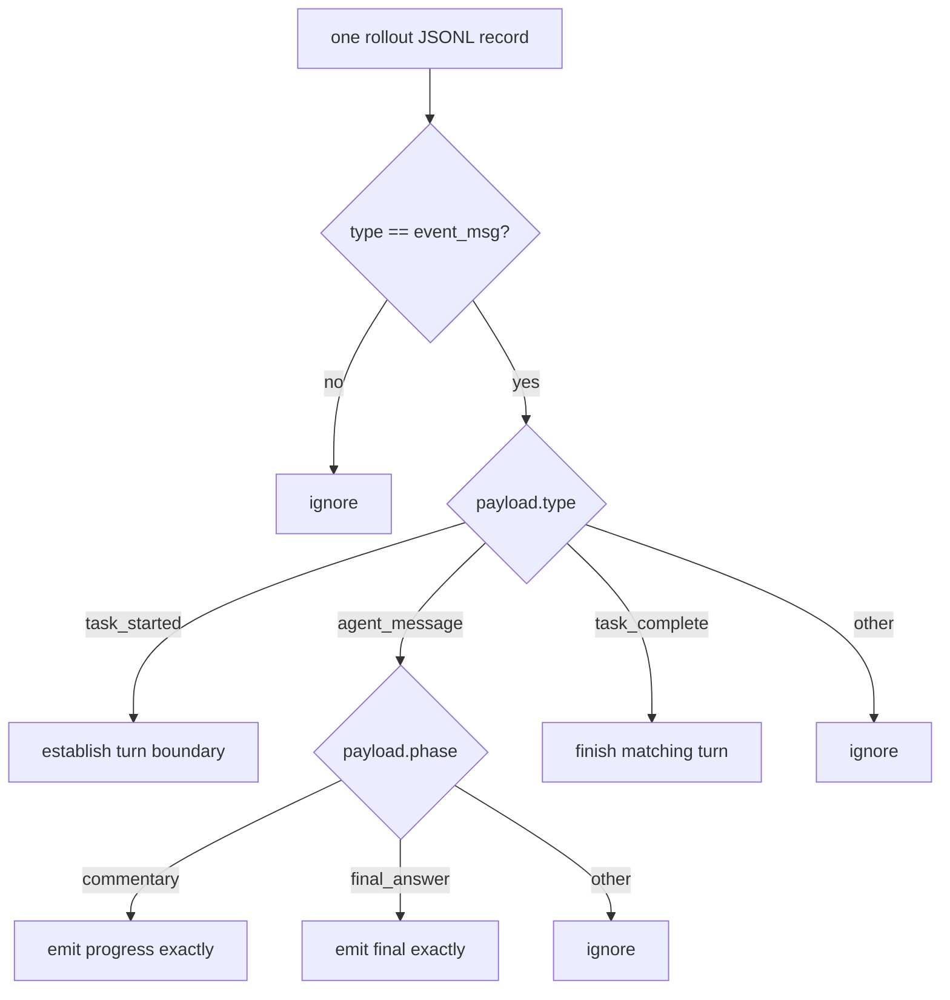
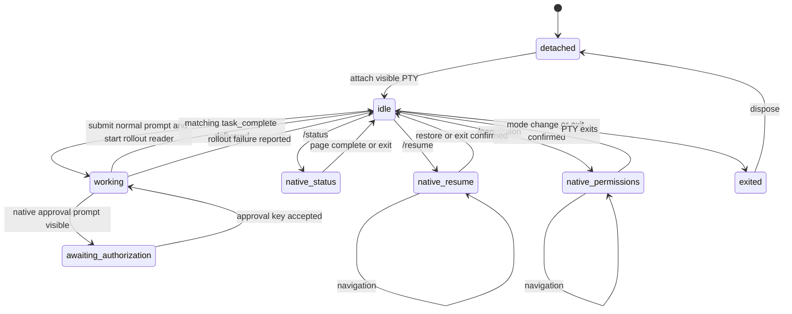
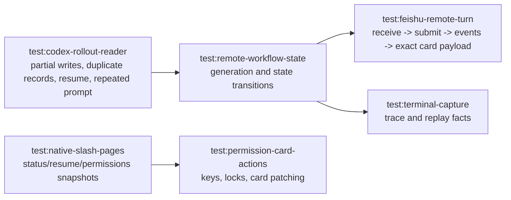

# Remote Codex Current Architecture

This document describes the implemented architecture after normal remote output
was moved from terminal-screen parsing to Codex rollout JSONL.

## 1. Core Invariant

Remote input and controls drive the same native Codex PTY shown in Electron.
Normal progress and final answers come only from the matching Codex rollout
file. PTY bytes and visual snapshots are retained for rendering, native slash
pages, approval prompts, busy UX, and diagnostics, but they are not fallback
answer sources.

## 2. Runtime Components

## 3. Normal Remote Turn

The reader starts before PTY submission. This prevents a very fast Codex turn
from appending history/output before the observer establishes its offsets.

## 4. Strict Rollout Binding

`CodexRolloutReader` fails closed. It does not select a file merely because it
is the newest rollout file.

1. Open `history.jsonl` at its current byte length.
2. Observe a newly appended record whose `text` exactly equals the submitted
   prompt and whose `session_id` is non-empty.
3. Resolve the rollout file whose filename ends in `-${session_id}.jsonl`.
4. Read a bounded tail and find an `event_msg.user_message` with the exact
   prompt and a timestamp at or after the current submission boundary.
5. Scan backward to the nearest `event_msg.task_started` and `turn_context`.
6. Reject the candidate when `turn_context.cwd` differs from the controlled
   session cwd.
7. Begin incremental reads at the located file offset and retain partial JSONL
   lines across polls.

This boundary prevents `/resume` from replaying old messages and prevents a
recent identical prompt from binding to the previous turn. Each controller turn
also has a generation number; callbacks from an older reader are ignored after
a new turn starts.

## 5. Accepted Rollout Events

`response_item` records are deliberately ignored because Codex commonly writes
the same assistant text both as `event_msg.agent_message` and as a response
item. Tool calls, command output, reasoning records, token counters, and terminal
redraws cannot enter normal Feishu payloads.

## 6. Feishu Delivery Modes

### Single-Card Default

- Enabled when `plugins.feishu.singleCardOutput=true`.
- One remote turn creates and sends exactly one CardKit entity.
- Commentary events accumulate with one blank line between semantic events and
  update only that card's markdown element.
- The final-answer event replaces accumulated commentary, disables streaming,
  and closes the same card in green.
- Binding and process failures close the same card in red.
- Semantic signatures suppress repeated event callbacks without changing text.
- Line breaks, lists, headings, and code fences are preserved through final
  CardKit markdown formatting.

### Legacy Segmented Cards

- Enabled only with `plugins.feishu.singleCardOutput=false` and
  `plugins.feishu.segmentedOutput=true`.
- Every commentary event becomes a separate blue progress card and the final
  answer becomes a green card. This remains for compatibility, not as the
  normal user experience.

### Failure Policy

Binding timeout, malformed state, missing `final_answer`, or reader failure
produces an explicit failure state in the original CardKit entity when one
exists. A successful full-card close remains authoritative even if an earlier
element update failed, so no second fallback card is sent. No PTY or
visual-snapshot fallback is attempted.

## 7. Terminal-Owned Paths

The terminal remains authoritative for interactive native UI surfaces:

- `/status`: parse the visible status panel and patch/send a non-action card.
- `/resume`: parse picker rows, keep selection updates on the same card, and
  confirm success only after the picker exits.
- `/permission` and `/permissions`: parse current Codex labels, including both
  `Default`/`Auto-review` and `Ask for approval`/`Approve for me` variants.
- Approval prompts: detect the visible question, command, reason, and numbered
  options; direct control buttons write exact key bytes.
- Busy/idle UX: use visual active signals and the prompt only to reject invalid
  concurrent input or confirm native page transitions.

These parsers cannot emit normal commentary or final answers.

## 8. Workflow State

## 9. Capture And Replay

Normal operation does not instantiate `RawOutputRecorder`; official rollout
JSONL already contains normal response history. Launching Electron with
`REMOTE_CODEX_DIAGNOSTIC_CAPTURE=1` stores native-TUI facts and parser traces in
`~/.local/state/remote-codex/raw-output.jsonl`. The diagnostic stream includes:

- source: `rollout_jsonl` or `native_terminal`
- rollout session ID, turn ID, path, event type, timestamp, and timing
- exact event text in base64 plus a clipped preview
- exact formatted output and semantic signatures
- final send/update/ignore decision

`npm run capture:replay -- ... --frame-mode all --parser-report ...` exports the
recorded timeline. It no longer reruns a terminal answer parser. Full terminal
controls remain useful only for native-page, approval, resize, or rendering bugs.

## 10. Response Source Matrix

| Source | Session ownership | Normal output | Native TUI controls |
| --- | --- | --- | --- |
| `rollout_jsonl` | Same visible PTY | Matching rollout events | Yes |
| `visual_terminal` / `pty` | Legacy aliases normalized to `rollout_jsonl` | Matching rollout events | Yes |
| `exec_json` | Independent `codex exec` process | Structured exec JSON | No |
| `app_server` | Independent app-server thread | Structured app-server events | No |

## 11. Test Acceptance Boundary

Parser strings are not the acceptance boundary. Tests inspect the exact
markdown passed to CardKit updates and the final CardKit close payload. Tests
also assert one card entity per turn. Terminal garbage is injected during
end-to-end simulations and must be absent from every outbound payload.

## 12. Ownership And Remaining Refactors

- `CodexRolloutReader` owns byte offsets, JSONL framing, session/turn binding,
  event filtering, and timeout failures.
- `RemoteSessionController` owns workflow state and transport-neutral delivery.
- Feishu modules own card formatting, transport, reactions, and action context.
- `CodexSessionManager` owns PTY lifecycle and capture hooks.

`remoteSessionController.js` remains large because native page lifecycle,
approval control, generic session commands, structured-runner compatibility,
and delivery coordination still share one class. A future low-risk split should
extract `nativeSlashController` and `remoteReplyCoordinator`; it must not
reintroduce terminal answer parsing or duplicate rollout ownership.
