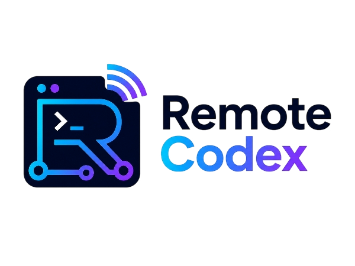

# Remote Codex

<p align="center">
  
</p>

Linux desktop and Feishu remote-control shell for the native Codex CLI.

> **Linux only.** Remote Codex intentionally focuses on Linux, where an
> official Codex desktop client is not currently the project's target. macOS
> and Windows builds are not produced or supported.

## Install on Linux

Requirements:

- A glibc 2.31 or newer Linux distribution, such as Ubuntu 20.04+, on `x86_64`
  or `arm64`.
- The native `codex` command available on `PATH` and signed in.
- `sha256sum` to verify a downloaded release package.

### Ubuntu and Debian (recommended)

Install the prebuilt `.deb` package with APT. Downloading the complete package
before installation makes interrupted downloads easier to resume, and APT
handles system dependencies, upgrades, and removal.

Choose the package that matches `dpkg --print-architecture`:

| Architecture | Package | SHA-256 checksum |
| --- | --- | --- |
| `amd64` (`x86_64`) | [remote-codex-linux-amd64.deb](https://github.com/xiaofan4122/Remote-Codex/releases/latest/download/remote-codex-linux-amd64.deb) | [remote-codex-linux-amd64.deb.sha256](https://github.com/xiaofan4122/Remote-Codex/releases/latest/download/remote-codex-linux-amd64.deb.sha256) |
| `arm64` (`aarch64`) | [remote-codex-linux-arm64.deb](https://github.com/xiaofan4122/Remote-Codex/releases/latest/download/remote-codex-linux-arm64.deb) | [remote-codex-linux-arm64.deb.sha256](https://github.com/xiaofan4122/Remote-Codex/releases/latest/download/remote-codex-linux-arm64.deb.sha256) |

Download the package and its checksum file into the same directory, then verify
and install it. For an `amd64` system:

```bash
cd ~/Downloads
sha256sum --check remote-codex-linux-amd64.deb.sha256
sudo apt install ./remote-codex-linux-amd64.deb
```

Use the `arm64` filenames instead on an ARM64 system. Installing the package
adds the desktop entry and the `remote-codex` command. The bundled
`remote-codex-send-files` skill is installed or refreshed for the current user
when the application first starts.

To remove the Debian package while preserving configuration in your home
directory:

```bash
sudo apt remove remote-codex
```

All current packages and portable archives are available on the
[GitHub Releases page](https://github.com/xiaofan4122/Remote-Codex/releases/latest).

### Other Linux distributions or installation without sudo

The user-local installer supports the same `x86_64` and `arm64` targets without
requiring root access. Download the release-published script first so a failed
script download is never piped directly into Bash, optionally inspect it, and
then run it:

```bash
curl -fL --retry 5 --retry-delay 2 \
  https://github.com/xiaofan4122/Remote-Codex/releases/latest/download/install.sh \
  --output remote-codex-install.sh &&
  less remote-codex-install.sh &&
  bash remote-codex-install.sh
```

This path requires `curl` or `wget`, `tar`, and `sha256sum`. The installer
downloads the matching portable archive, verifies its SHA-256 checksum, and
atomically activates it under `~/.local/opt/remote-codex`. It also creates the
user-local command and desktop entry and installs the bundled skill. It does
not edit shell startup files.

Running the installer again performs an idempotent update. To install a
specific tagged version with the downloaded script:

```bash
bash remote-codex-install.sh --version 0.1.0
```

Remove a user-local installation and its managed skill while preserving user
configuration with:

```bash
remote-codex-uninstall
```

The installer retries failed downloads, but it does not resume a partially
downloaded application archive. On an unreliable connection, Debian and Ubuntu
users should prefer downloading the `.deb` with a browser or resumable download
tool.

### Start and update

Start from a project directory:

```bash
cd /path/to/project
remote-codex
```

Remote Codex can update itself from GitHub Releases. In **Settings → Software
Updates**, keep automatic updates enabled to check after startup, download the
matching full Linux package in the background, and install it on normal exit.
After the download completes, **Install and Restart** applies it immediately.
Turn the option off to prevent background update checks and downloads; the
manual **Check for Updates** action remains available.

Debian installations download and verify the complete `.deb`, then use the
desktop system-authorization flow to install it. User-local installations made
by `install.sh` download the complete `.tar.gz`, verify its SHA-256 checksum,
and reuse the installer's versioned directory plus atomic `current` symlink.
Application code never runs a partial `.deb` patch. Development checkouts and
unrecognized portable directories do not update themselves.

## Develop From Source

```bash
npm ci
npm start
```

Development requires Node.js 22.12 or newer. The app expects `codex` to be
available on `PATH`; complete Codex authentication in a normal terminal first.
Electron's Linux binary is downloaded once by `npm ci` and then kept in the
local dependency/cache directories. `npm start` only launches that installed
binary and does not perform a download. Release installations use the bundled
Electron runtime and require neither Node.js nor an Electron download.
Remote Codex starts Codex with `--no-alt-screen` by default so the desktop
terminal keeps a usable scrollback history instead of losing content to TUI
screen redraws.

## App Launcher

When running from a source checkout, install developer launchers with:

```bash
npm run install:launchers
```

This installs:

- `remote-codex`: opens the Electron app.
- `remote-codex-dev`: opens the Electron app with the configured default folder.
- `remote-codex-api`: starts the headless API server.
- `Remote Codex`: desktop launcher entry.
- `remote-codex-send-files`: a Codex skill installed under
  `${CODEX_HOME:-~/.codex}/skills` for returning generated files to Feishu.

After installing, open the app from your terminal with:

```bash
remote-codex
```

Arguments that belong to the Codex CLI are forwarded when the native session
starts. Configured `codex.args` are applied first, followed by the launch
arguments:

```bash
remote-codex --model gpt-5 "Review the current changes"
remote-codex --search --sandbox workspace-write
```

Resume an existing Codex TUI session at startup:

```bash
remote-codex --resume --last
remote-codex --resume SESSION_ID
remote-codex resume --last
```

Environment-variable form:

```bash
REMOTE_CODEX_RESUME=last remote-codex
REMOTE_CODEX_RESUME=SESSION_ID REMOTE_CODEX_RESUME_PROMPT="continue" remote-codex
```

When `remote-codex` is stopped from the terminal with Ctrl-C, it prints the
matching resume command. If the current Codex status screen exposed a native
session ID, the hint uses that ID; otherwise it falls back to `--resume --last`.

When launched from a terminal with `remote-codex`, Remote Codex uses that
terminal's current directory as the Codex working directory. The folder saved in
Settings is kept for `remote-codex-dev`; `CODEX_WORKDIR` still overrides both.

Or start the background API with:

```bash
remote-codex-api
```

This source-checkout helper writes launchers to `~/.local/bin`, creates a desktop file under
`~/.local/share/applications`, and makes sure `~/.local/bin` is available from
both zsh and bash. It also installs or updates the bundled file-send skill. If
you move this project directory, run the installer again.

Release builds are Linux-only:

```bash
npm run dist:linux:x64
npm run dist:linux:arm64
```

Official artifacts are built reproducibly inside the pinned Debian 11 / Node
22 container so their native modules retain a glibc 2.31 compatibility floor:

```bash
bash scripts/build-linux-release-container.sh x64
bash scripts/build-linux-release-container.sh arm64
npm run smoke:linux-artifact -- x64
```

The container build mounts the checkout read-only, installs dependencies in an
isolated temporary workspace, reuses persistent npm/Electron build caches, and
copies only the finished archives and checksums into `dist/`. It never replaces
the source checkout's `node_modules`.

Run the complete deterministic test and syntax suite with:

```bash
npm run check
```

## Configuration

Copy the example config when you want file-based settings:

```bash
cp config.example.json config.json
REMOTE_CODEX_CONFIG=./config.json npm start
```

If `REMOTE_CODEX_CONFIG` is not set, the app reads and writes:

```text
~/.remote-codex.json
```

Legacy `CODEX_SHELL_CONFIG` and `~/.codex-electron-shell.json` are still read
for compatibility.

Configuration priority:

```text
environment variables > config file > defaults
```

Optional environment variables:

```bash
REMOTE_CODEX_CONFIG=/path/to/config.json
CODEX_WORKDIR=/path/to/project npm start
CODEX_COMMAND=/full/path/to/codex npm start
```

The Electron Settings panel intentionally stays small: default project folder
and Feishu connection. Advanced deployment options remain available through the
config file and environment variables.

## Logs

Remote Codex writes runtime logs to:

```text
~/.local/state/remote-codex/remote-codex.log
```

The log includes plugin startup, Feishu inbound messages, remote commands,
session starts/exits, and cleaned reply text. Secrets and tokens are redacted.

## Integration Plugins

Integration plugins live under `src/plugins/`. Each plugin implements the same
small runtime interface:

```js
async start() {}
async stop() {}
async invoke(action, payload) {}
getStatus() {}
```

Remote message plugins should call the shared remote controller instead of
directly writing to the PTY. See `src/plugins/README.md`.

### Feishu

The built-in Feishu plugin supports:

- `long_connection`: enterprise self-built app bot using Feishu's official
  WebSocket SDK. This supports sending commands to Codex and receiving output.
- `custom_webhook`: Feishu group custom robot webhook. This is useful for
  outbound notifications and testing, but not for receiving commands.

The easiest setup path is:

1. Open `Settings`.
2. Click `Connect Feishu`.
3. Scan or open the Feishu authorization link.
4. Add the created bot to the target chat.
5. In the Feishu Developer Console, publish a floating bot menu with:
   `状态 /status`, `历史会话 /resume`, and `权限模式 /permission`.

After authorization, the app stores the returned App ID/App Secret, enables
long connection mode, and adds the authorizing user's Open ID to the allowlist.
The bot menu must currently be configured in the Feishu Developer Console.
The documented public APIs and current official SDK do not expose a supported
endpoint that Remote Codex can use to publish these direct-chat menu actions.
See
https://open.feishu.cn/document/client-docs/bot-v3/add-custom-bot.

The Electron window shows the native Codex TUI, so slash commands, approvals,
keyboard shortcuts, model switching, and other TUI behavior continue to come
from Codex itself.

Feishu replies default to `rollout_jsonl`. Remote messages still drive the same
native Codex TUI shown in the Electron window, preserving slash commands,
approval prompts, keyboard navigation, and model switching behavior. Normal
reply text, however, is read from the matching Codex rollout JSONL instead of
being reconstructed from the terminal screen.
Plain remote text is submitted through bracketed paste followed by Enter, using
the same Codex composer shown in Electron.
If Codex is already working, another normal remote message is still written to
the native Codex queue immediately. Remote Codex starts a separate rollout
observer before the write, then opens that message's card after the preceding
card closes, preserving response order without the old busy-rejection reply.
Approval prompts and native picker pages remain blocking controls. Approval
request content and lifecycle are read from the bound rollout JSONL and keyed
by Codex `call_id`. Persisted allow prefixes are cross-checked against
`~/.codex/rules/default.rules`; terminal snapshots are not parsed for approval
cards.
Feishu remote turns default to one CardKit entity per task. Ordered rollout
`agent_message` events with `phase=commentary` accumulate in that card while it
is blue and marked as processing. `phase=final_answer` replaces the body with
the final answer only, then closes the same card in the green completed state.
Rollout binding or process failures close that same card in red. Duplicate
`response_item` records, tool events, historical turns, terminal repaints, and
resize redraws are not output sources. Set `plugins.feishu.singleCardOutput`
to `false` only when legacy segmented cards are explicitly required.
The rollout reader tails appended JSONL records at a short polling interval, so
commentary can be delivered while Codex is still running. `task_complete`
closes the turn; visible terminal idle timing does not synthesize a final reply.
For long-running turns, Remote Codex proactively renews CardKit streaming mode
before Feishu's ten-minute lease expires. If Feishu still returns CardKit error
`200510`, the same card is reopened and the failed update is retried with a new,
strictly increasing sequence number.

After the first authorization, `Reset Feishu Connection` is shown as a red
destructive action. After confirmation, it stops the old long connection,
removes the locally saved app credentials and access bindings, and starts a new
`registerApp` authorization flow. Remote Codex cannot delete the old app in
Feishu; delete it manually in the Feishu Developer Console if it is no longer
needed.

### Multiple instances

The Linux desktop is single-instance by default. Starting `remote-codex` again
focuses the existing window instead of opening another Codex session or another
Feishu long connection.

Do not bypass this protection and connect multiple Remote Codex processes to the
same Feishu App ID/App Secret. Feishu can deliver inbound events to a different
long connection, while each process keeps its current Codex task, card ID, and
CardKit sequence in local memory. That can route a command to the wrong project,
create duplicate cards, or leave card actions and updates owned by different
processes. Intentional parallel deployments should use separate Linux
users/containers, separate configuration and Codex data, and a separate Feishu
app for each instance. The independent headless API process does not create a
Feishu connection unless it is configured to do so.

Final answers can contain block LaTeX (`\\[...\\]`, `$$...$$`, or a standalone
`[...]` math block) and inline LaTeX (`\\(...\\)` or `$...$`). Remote Codex
renders formulas locally with bundled MathJax and resvg-WASM, uploads PNGs to
Feishu, then closes the card with image components. Short lines containing
inline formulas are composed as one text-and-formula image so their reading
order stays intact. Rendering and image keys are cached; failures fall back to
readable code blocks instead of leaking partial images. The default completed
card limit is 64 rendered formula regions and can be changed with
`plugins.feishu.latexMaxFormulas`.

The installed `remote-codex-send-files` skill lets Codex declare completed
workspace files in its structured final answer. Remote Codex strips those
declarations from the card, rejects paths outside the active working directory,
then uploads valid files through the Feishu app API. The default limits are five
files per turn and 30 MB per file. File transfer requires `long_connection`;
custom webhooks cannot upload files.

For an independent headless structured session, set
`remoteControl.responseSource` to `app_server` or `exec_json`. Those paths do
not mirror the visible TUI session; `rollout_jsonl` is the structured path that
keeps the visible PTY as the controlled Codex session.

`~/.codex/history.jsonl` is used only to associate a submitted prompt with its
Codex session ID. Normal output is then read incrementally from the matching
`~/.codex/sessions/**/rollout-*.jsonl`. If this binding fails, Remote Codex
reports an explicit error and does not fall back to terminal text.

Remote Codex does not record PTY input, output, or snapshots during normal
operation. Normal response history and approval events already come from
Codex's official rollout JSONL files. For a native `/resume`, `/permission`,
resize, or TUI rendering bug, start Electron with explicit diagnostic capture:

```bash
REMOTE_CODEX_DIAGNOSTIC_CAPTURE=1 npm start
```

The optional capture is written to
`~/.local/state/remote-codex/raw-output.jsonl`; override it with
`REMOTE_CODEX_DIAGNOSTIC_CAPTURE_PATH`. It records full terminal controls and
parser decisions for deterministic native-TUI replay. It can contain prompts,
command output, and file contents, so leave it disabled outside an active
diagnostic session.

Replay and verify a capture:

```bash
npm run capture:replay -- /path/to/raw-output.jsonl
npm run capture:replay -- /path/to/raw-output.jsonl --frames /tmp/frames.jsonl --frame-mode all --parser-report /tmp/parser-report.json
```

Export a redacted fixture before sharing a capture or committing a parser
sample:

```bash
npm run capture:export-fixture -- /path/to/raw-output.jsonl /tmp/capture.fixture.jsonl
```

When the bound rollout records a sandbox-authorization request, Remote Codex
sends a dedicated confirmation card with the structured command and reason.
Use the card buttons or send `/approve`, `/always`, or `/deny`; only the selected
control key is written back to the visible TUI. Native selection pages still use
`/up`, `/down`, and `/enter` to pass through the matching terminal keys.

For advanced/manual Feishu setup, configure these in the config file:

- `plugins.feishu.enabled`
- `plugins.feishu.mode`
- `plugins.feishu.appId`
- `plugins.feishu.appSecret`
- `plugins.feishu.allowedOpenIds`
- `plugins.feishu.allowedChatIds`
- `plugins.feishu.singleCardOutput`
- `plugins.feishu.segmentedOutput`
- `plugins.feishu.streaming`
- `plugins.feishu.fileTransferEnabled`
- `plugins.feishu.fileTransferMaxBytes`
- `plugins.feishu.fileTransferMaxFiles`
- `plugins.feishu.latexRenderingEnabled`
- `plugins.feishu.latexMaxFormulas`
- `plugins.feishu.flushIntervalMs`
- `plugins.feishu.finalReplyDebounceMs`
- `plugins.feishu.ackReactionEmoji`: Feishu expects official `emoji_type`
  values, not arbitrary UI labels. The local aliases `了解` and `收到` map to
  the official `Get` reaction; invalid custom values fall back to `OK`.

The Electron Settings panel exposes `latexRenderingEnabled` and
`latexMaxFormulas` directly under Feishu settings.

Remote commands:

```text
/start [cwd]
/stop
/status
/resume
/permission
/model
/skills
/plugins
/usage
/mcp [verbose]
/ps
/diff
/review
/new
/fork
/plan [prompt]
/goal [objective|clear|edit|pause|resume]
/compact
/init
/side [prompt]
/codex-stop
/codex-approve
/tail
/approve
/always
/deny
/enter
/up
/down
/esc
/help
```

Native picker commands update one card while the user navigates. `/diff` uses
scroll/page controls and `q`-style exit semantics. `/review` switches from the
native preset picker to the next rollout JSONL task, so terminal repaint text
never becomes review output. `/compact`, `/init`, `/side`, and `/plan` with an
inline prompt also bind the next structured rollout task rather than matching
the literal slash command in history. Selecting Full Access from `/permission`
automatically accepts Codex's recognized Full Access risk confirmation when
the continue option is selected; unknown or cancel-selected pages remain
interactive.

Remote `/stop` and `/approve` keep their Remote Codex meanings. Use
`/codex-stop` for Codex's background-terminal stop command and
`/codex-approve` for Codex's auto-review retry command. Destructive native
commands `/archive`, `/delete`, `/logout`, `/exit`, and `/quit` are blocked over
remote control and must be run locally. Any other message is sent to the current
Codex session.

## Headless API

Start the local API server without opening the Electron window:

```bash
npm run api
```

By default it listens on `http://127.0.0.1:4317` and starts `codex` from your
`PATH`.

Useful environment variables:

```bash
CODEX_API_PORT=4317
CODEX_API_HOST=127.0.0.1
CODEX_API_TOKEN=change-me
CODEX_WORKDIR=/path/to/project
CODEX_COMMAND=/full/path/to/codex
FEISHU_ENABLED=1
FEISHU_MODE=long_connection
FEISHU_APP_ID=cli_xxx
FEISHU_APP_SECRET=xxx
REMOTE_CODEX_AUTO_UPDATE=true
```

Headless Feishu connect flow:

```bash
curl -X POST http://127.0.0.1:4317/plugins/feishu/connect
curl http://127.0.0.1:4317/plugins/feishu/connect
```

Open the returned `url` or render `qrDataUrl`, then poll the status endpoint
until it returns `complete`.

If `CODEX_API_TOKEN` is set, every request needs:

```text
Authorization: Bearer change-me
```

### API

Health check:

```bash
curl http://127.0.0.1:4317/health
```

Create a Codex session:

```bash
curl -X POST http://127.0.0.1:4317/sessions \
  -H 'content-type: application/json' \
  -d '{"cwd":"/path/to/project","cols":120,"rows":34}'
```

Send input to a session. Include newline when you want to press Enter:

```bash
curl -X POST http://127.0.0.1:4317/sessions/SESSION_ID/input \
  -H 'content-type: application/json' \
  -d '{"data":"help\n"}'
```

Read output after a cursor:

```bash
curl 'http://127.0.0.1:4317/sessions/SESSION_ID/output?cursor=0'
```

Resize:

```bash
curl -X POST http://127.0.0.1:4317/sessions/SESSION_ID/resize \
  -H 'content-type: application/json' \
  -d '{"cols":100,"rows":30}'
```

Stop:

```bash
curl -X DELETE http://127.0.0.1:4317/sessions/SESSION_ID
```

See [API.md](./API.md) for the complete API reference.
