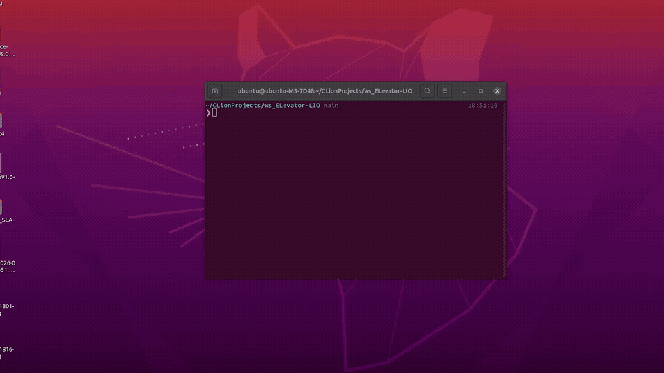
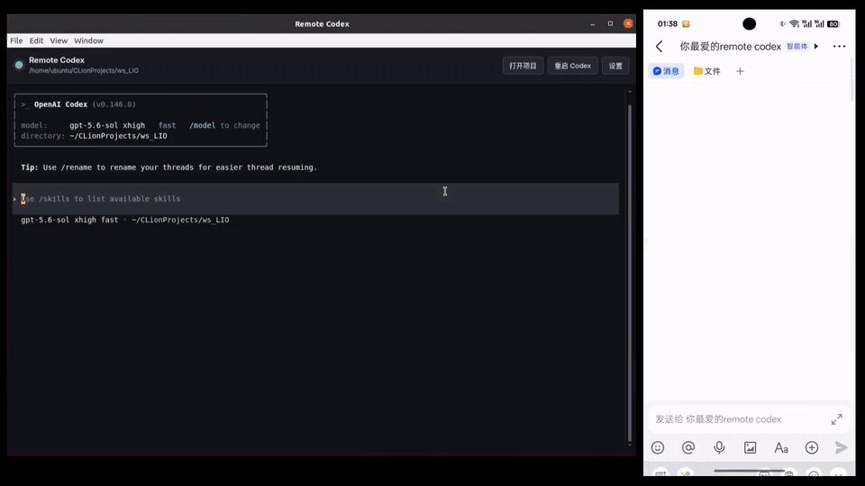
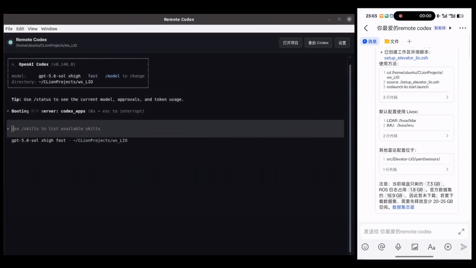
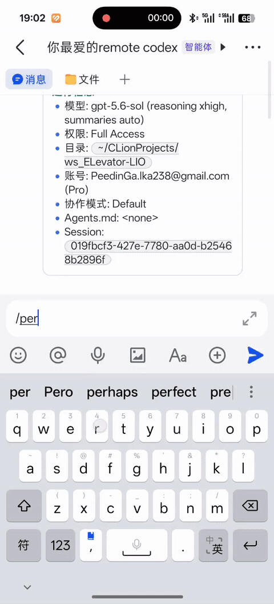
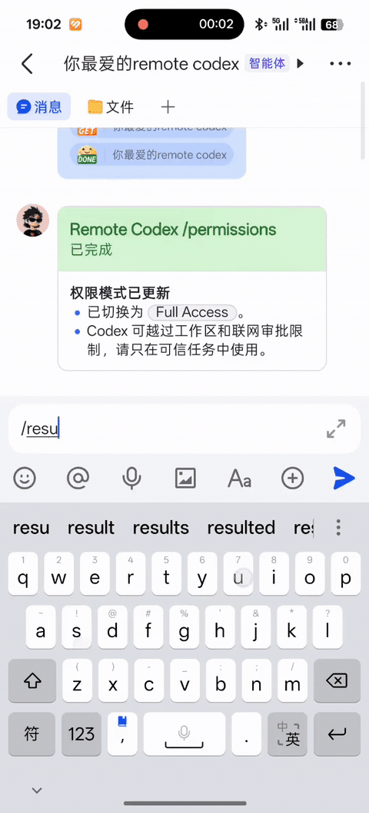
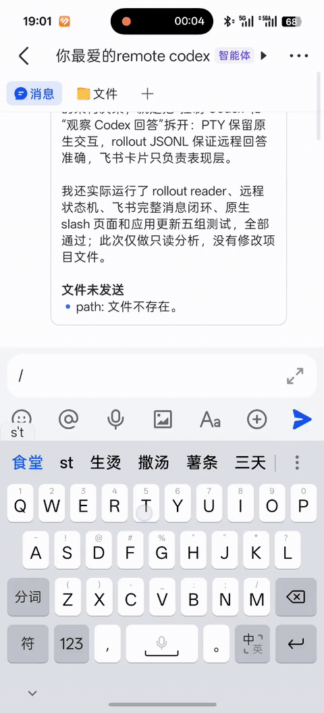

<p align="center">
  <a href="./README.md">中文</a> | English
</p>

# Remote Codex

<p align="center">
  
</p>

Remote Codex is a Linux desktop and Feishu remote-control shell for the native
Codex CLI.

> **Linux only.** Supported release architectures are `x86_64` and `arm64`.
> Install and sign in to the native `codex` command before using Remote Codex.

## Why Remote Codex?

- **Native Codex, wrapped—not replaced.** The TUI, commands, permissions, and
  sessions still belong to the native Codex CLI.
- **Develop from anywhere.** Send tasks from Feishu and follow progress in one
  live-updating card instead of a stream of noisy messages.
- **Fast Feishu setup.** Connect a bot from the desktop Settings panel through
  the built-in authorization flow.
- **Readable technical output.** LaTeX is detected and rendered locally,
  including short lines that mix text and inline formulas.
- **Built-in file delivery.** Reports, patches, images, and other workspace
  files can be returned directly to the active Feishu conversation.

### The same native Codex workflow

<p align="center">
  
</p>

### One card, updated continuously

Remote progress, actions, and the final answer stay in one live-updating card.

<p align="center">
  
</p>

### LaTeX, rendered automatically

Formula regions are recognized locally and embedded into the Feishu card as
readable rendered images.

<p align="center">
  
</p>

### Native Codex controls, available remotely

Selected native Codex pages are mapped to interactive Feishu cards. Their
actions still drive the same visible Codex TUI—they do not replace or
reimplement the underlying workflow.

<table>
  <tr>
    <th>Permission modes</th>
    <th>Resume sessions</th>
    <th>Session status</th>
  </tr>
  <tr>
    <td></td>
    <td></td>
    <td></td>
  </tr>
  <tr>
    <td align="center"><code>/permission</code></td>
    <td align="center"><code>/resume</code></td>
    <td align="center"><code>/status</code></td>
  </tr>
</table>

## Install

Requirements:

- A Linux distribution with glibc 2.31 or newer, such as Ubuntu 20.04+.
- The native `codex` command available on `PATH` and already signed in.

### Ubuntu and Debian

Download the package matching `dpkg --print-architecture`:

| Architecture | Download |
| --- | --- |
| `amd64` | [remote-codex-linux-amd64.deb](https://github.com/xiaofan4122/Remote-Codex/releases/latest/download/remote-codex-linux-amd64.deb) |
| `arm64` | [remote-codex-linux-arm64.deb](https://github.com/xiaofan4122/Remote-Codex/releases/latest/download/remote-codex-linux-arm64.deb) |

Install the downloaded package, using the ARM64 filename when appropriate:

```bash
sudo apt install ./remote-codex-linux-amd64.deb
```

Start Remote Codex from a project directory:

```bash
cd /path/to/project
remote-codex
```

Updates can be checked and installed from **Settings → Software Updates**.

To uninstall:

```bash
sudo apt remove remote-codex
```

See all packages on the [GitHub Releases page](https://github.com/xiaofan4122/Remote-Codex/releases/latest).

## Connect Feishu

1. Open **Settings** in Remote Codex.
2. Select **Connect Feishu**.
3. Open or scan the authorization link.
4. Add the created bot to the conversation you want to use.

Messages from Feishu drive the same visible Codex session shown in Electron.
Common remote controls include `/status`, `/resume`, `/permission`, and
`/stop`. Destructive native commands such as `/delete`, `/logout`, and `/exit`
are blocked remotely.

Tasks entered in the desktop client stay local by default. Enable **Send new
desktop tasks to Feishu** in Settings to forward newly submitted prompts and
their rollout replies to Feishu. File delivery remains available for desktop
tasks when this forwarding option is off.

Remote Codex can run multiple desktop windows at once. When more than one is
open, the toolbar shows **Connect this window to Feishu**. The newest window is
selected by default; selecting another window transfers the single Feishu
connection to that window and its Codex session.

## How It Works

```text
Feishu input ──→ RemoteSessionController ──→ visible Codex PTY
                                                    │
Codex rollout JSONL ──→ semantic events ──→ one Feishu card
```

Remote input controls the same native PTY used by the Electron terminal.
Normal progress and final answers come from the matching Codex rollout JSONL,
not from terminal screen scraping. Terminal snapshots are used only for native
pages such as `/resume`, `/permission`, and approval prompts.

## Develop From Source

Development requires Node.js 22.12 or newer:

```bash
npm ci
npm start
```

Run the complete test and syntax suite with:

```bash
npm run check
```

Start the optional local headless API with `npm run api`.

## Configuration and Documentation

Runtime configuration is stored in `~/.remote-codex.json`. See
[config.example.json](./config.example.json) for the supported structure.

- [Architecture](./ARCHITECTURE.md)
- [Feishu integration](./src/plugins/feishu/README.md)
- [Headless API](./API.md)
- [Contributing and releases](./CONTRIBUTING.md)
- [Security policy](./SECURITY.md)

## License

[MIT](./LICENSE)
